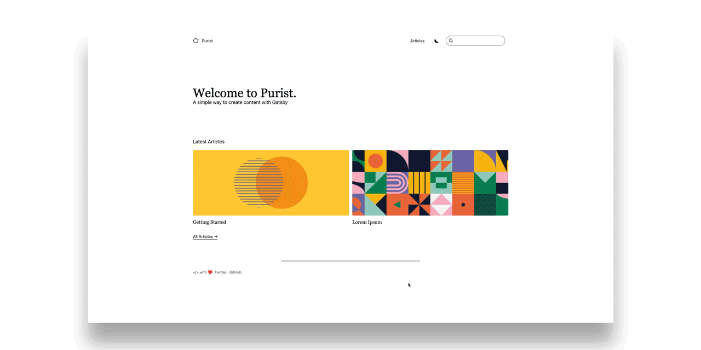
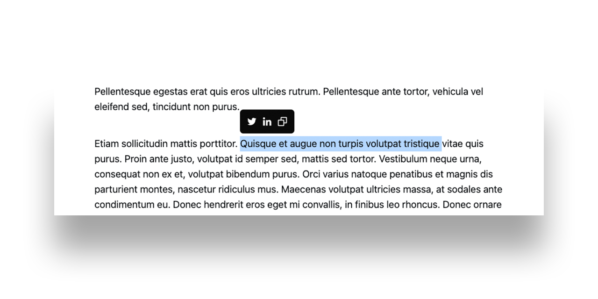

# Purist – A Gatsby theme

A clean, full-featured theme with built-in search, dark mode and social sharing
– all for creating content with Gatsby.

## Features

Why you should use Purist:

### Search

Search is built in using
[FlexSearch.js](https://github.com/nextapps-de/flexsearch) to find content
quickly and easily.

### Dark mode

A toggable light and dark theme are available out of the box using the
`prefers-color-scheme` media query to determine the default theme.



### Social Sharing

You can select text within an article to easily copy or share directly with
Twitter and LinkedIn.



## Getting Started

A guide on how to get started with Purist.

### Installation

Using the `gatsby-cli`:

```
gatsby new my-site https://github.com/sebsojeda/gatsby-starter-purist
```

Using `git`:

```
git clone https://github.com/sebsojeda/gatsby-starter-purist my-site

cd my-site

yarn
```

### Development & Build

Once the starter has been downloaded, you can begin development.

```
# Run localhost
yarn dev

# Production build
yarn build

# Clear all caches
yarn clean
```

### Creating an article

To create an article, create a new folder in `/content/articles/`. You can name
it anything you'd like, but the folder name will determine the slug for the
page. Then you can add an `index.mdx` file for your content. Any media files for
your article can also go in this folder.

`/content/articles/my-first-article/index.mdx `

```
---
title: My first article
date: 2020-12-25
featuredImage: ./hero.jpg
draft: false
---
# Create your awesome MDX content here
```

### Configuring site metadata

Add a site configuration to customize the theme to your liking.

`/gatsby-config.js`

```
module.exports = {
  siteMetadata: {
    name: 'Purist',
    defaultTitle: 'Purist: Creating content',
    titleTemplate: '%s • Purist: Creating content',
    description: 'This is my description that will be used in the meta tags and important for search results',
    hero: {
      heading: 'Welcome to Purist.',
      subheading: 'A clean way to create content with Gatsby',
    },
    social: [
      {
        name: 'Twitter',
        url: 'https://twitter.com/sebsojeda',
      },
      {
        name: 'GitHub',
        url: 'https://github.com/sebsojeda',
      },
    ],
  },
  plugins: ['gatsby-theme-purist']
}
```

## Customization

### Adding your logo

### Changing styles

`/gatsby-theme-purist`

## Data Models

### Article

| Key           | Required | Type    | Description                                                       |
| ------------- | -------- | ------- | ----------------------------------------------------------------- |
| title         | required | String  | Used as the article title.                                        |
| date          | required | Date    | YYYY-MM-DD format.                                                |
| featuredImage | optional | File    | The image to be featured on the article.                          |
| draft         | required | Boolean | If draft is `true`, the article will not be rendered on the site. |

### Site Metadata

| Key             | Required | Type   | Description                                                                    |
| --------------- | -------- | ------ | ------------------------------------------------------------------------------ |
| name            | required | String | The name to display in the navigation.                                         |
| defaultTitle    | required | String | Fallback text for the \<title\>\</title\> tag.                                 |
| titleTemplate   | required | String | Template used for the \<title\>\</title\> tag.                                 |
| description     | required | String | Used for the \<meta name="description"\>\</meta\> tag.                         |
| hero.heading    | required | String | Text displayed on the homepage hero.                                           |
| hero.subHeading | optional | String | Subtext displayed on the homepage hero.                                        |
| social          | optional | Array  | List of objects containing a `name` and a `url` to include in the site footer. |
